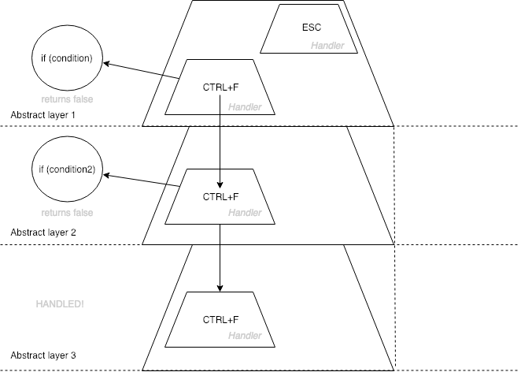

# Stack shortcuts
## Pure, no dependencies library for organize you shortcuts (hotkeys) in modern web app. Less than 1.5kb.

[](https://travis-ci.org/BusinessDuck/stack-shortcuts)
[](https://coveralls.io/github/BusinessDuck/stack-shortcuts?branch=master)
[](https://badge.fury.io/js/stack-shortcuts)

[](https://opensource.org/licenses/mit-license.php)

## Quick start

### npm
```bash
npm i stack-shortcuts --save
```

### browser
```html
<script src="https://raw.githubusercontent.com/BusinessDuck/stack-shortcuts/master/lib/shortcuts.umd.js"></script>
```


## Sandbox
[](https://codesandbox.io/s/zrxl392pq3)
## The problem

#### Initial data:
Imagine, you have an application with small `picture`, you can move it along `x and y axis` by the `keyboard arrows`. Mouse click on the `picture`, should open a `modal dialogue` with full sized picture.
And now for example you need to use `arrowUp` and `arrowDown` buttons for navigate to related images (prev, next)
#### Lets see the task problems:
**Problem 1:**
To handle keypress event you should use inconvenient and not clear contract
```js
element.addEventListener('keydown', handler);

function handler(event) {
    event.key; // does not supported to any browsers
    event.keyIdentifier ; // deprecated
    event.keyCode; // supports all browsers but inconvenient

    event.keyCode === 27 // ESC (should google it every time)
}
```
**Problem 2:**
When you have a different controllers for `picture` and `modal dialogue` you should resolve hotkey press in two different controllers, they are shouldn't to know about each other. The best solution will be create third control (or use parent control) for manage hotkeys depend from child controllers `state`. Its a big problem for big apps.

**Problem 3:**
If you want yo handle key pressing in different controllers you will be depends from `DOM positions` of elements. Because events is `bubbling`. That mean yuo may solve this problem by `useCapture` it's works, but not clean. That will produce refactoring and debugging processes as well.


## Greet the solution!

### Diagram of the concept



Abstract layer is a `controller`. By using `stack-shortcuts` you can create a layers with handlers and condition statement and handle hotkeys pressing or pass to next layer if condition is `false`

```js
// controller 1
...
this.shortuts = shortcuts({
    'CMD+F': (event, next) => {
        // event - native event
        // next - call pass event to next in stack layer handler
        // like a express controller

        if (event.target === myDOMElement) {
            alert('its works');
        } else {
            next();
        }
    }
});

// controller 2
this.shortuts = shortcuts({
    'CMD+F': (event, next) => {
        // event - native event
        // next - call pass event to next in stack layer handler
        // like a express controller

        if (event.target === mySecondDOMElement) {
            alert('its works');
        } else {
            next();
        }
    }
});
```

## Getting Started

```sh
npm i stack-shortcuts --save
```

## Features
1. DOM element position independent
2. Human shortcuts names
    ```js
    shortcuts({
        'ALT+SHIFT+T': () => null, //handle ALT+SHIFT+T
        'ALL': () => null, // handle aall kedon
    });
    ```
3. Platform auto mapping CMD to CTRL
    ```js
    shortcuts({
        'CMD+F': (event, next) => null, //handle CTRL+F on windows
    });
    ```
4. Destructor
    ```js
    const hotkeys = shortcuts({
        'CMD+F': () => null
    });

    hotkeys.destroy(); // remove shortcuts layer
    ```
5. Next callback
    ```js
    shortcuts({
        'CMD+F': (event, next) => {
            next(); // pass to next in stack layer
        },
    });
    ```
6. Easy to debugging call stack in stacktrace

    **You will see the all chain of stack layers calls in debugger stacktrace**
7. Dynamically add and remove shortcuts
    ```js
    const layer = shortcuts({ // init config
        'CMD+F': (event, next) => {
            next(); // pass to next in stack layer
        },
    });

    layer.add('CMD+V', (event, next) => null);
    layer.remove('CMD+V', (event, next) => null);

    ```
8. Order free, both is the same
    ```js
    const layer = shortcuts();

    layer.add('SHIFT+CMD+V', (event, next) => null);
    layer.remove('SHIFT+CMD+V');

    layer.add('CMD+SHIFT+V', (event, next) => null);
    layer.remove('CMD+SHIFT+V');
    ```
9. **No dependencies and small size (less than 3 kb)**

See example in `examples`

Works fine with `react` and other frameworks out of the box.
